# Database Structure (ERD)

## Overview
This document outlines the database schema for the Connect social platform, utilizing SQL for core data and relational structures, and Firebase for real-time chat functionality.

### **Architecture Highlights**
*   **SQL (PostgreSQL/Supabase)**: User data, profiles, relationships, content (posts, groups), and moderation.
*   **Firebase (Realtime Database)**: Chat messages and conversations.
*   **Authentication**: JWT based flow with `REFRESH_TOKENS` table for device management.

---

## Entity Relationship Diagram (Mermaid)

```mermaid
erDiagram
    %% ========== AUTH ==========
    USERS {
        int id PK
        string username UK "Unique"
        string email UK "Unique"
        string password_hash
        enum role "admin, user"
        boolean is_locked "false"
        boolean is_deleted "false"
        datetime created_at
        datetime last_login
    }

    REFRESH_TOKENS {
        bigint id PK
        bigint user_id FK
        string token_hash UK "SHA256 - Unique"
        text user_agent "Browser/Device info"
        string ip_address "VARCHAR 45 - IPv6"
        datetime created_at
        datetime last_used_at
        datetime expires_at
        boolean is_revoked "false"
    }

    USER_PROFILES {
        int id PK
        int user_id FK,UK "1-1 với Users"
        int city_id FK
        string full_name
        date date_of_birth
        enum gender "male, female, other"
        string bio "Giới thiệu ngắn"
        string occupation
        enum marital_status "single, divorced, widowed"
        enum looking_for "love, friends, networking"
        datetime updated_at
    }

    MEDIA {
        int id PK
        int uploader_id FK "User upload"
        string url "Cloudinary URL"
        string thumbnail_url "Ảnh nhỏ"
        enum type "image, video"
        int size_bytes
        datetime uploaded_at
        boolean is_deleted "false"
    }

    USER_AVATARS {
        int id PK
        int user_id FK
        int media_id FK
        boolean is_current "Chỉ 1 ảnh = true"
        datetime set_at
    }

    USER_COVERS {
        int id PK
        int user_id FK
        int media_id FK
        boolean is_current
        datetime set_at
    }

    USER_GALLERY {
        int id PK
        int user_id FK
        int media_id FK
        int display_order "1, 2, 3..."
        boolean is_verified "Admin xác thực"
        datetime added_at
    }

    CITIES {
        int id PK
        string code UK "hanoi, hcm"
        string name "Hà Nội"
        string region "north, central, south"
    }

    HOBBIES {
        int id PK
        string code UK "music, travel"
        string name "Âm nhạc"
        string icon "music_note"
        string category "lifestyle, sports, arts"
    }

    USER_HOBBIES {
        int user_id FK,PK
        int hobby_id FK,PK
    }

    HASHTAGS {
        int id PK
        string name UK "Without #"
        int post_count "Denormalized count"
        datetime created_at
    }

    POST_HASHTAGS {
        int post_id FK,PK
        int hashtag_id FK,PK
    }

    FRIEND_REQUESTS {
        int id PK
        int sender_id FK
        int receiver_id FK
        enum status "pending, accepted, rejected"
        datetime created_at
        datetime responded_at
    }

    FRIENDS {
        int user_id FK,PK "User A"
        int friend_id FK,PK "User B"
        datetime created_at
    }

    BLOCKED_USERS {
        int user_id FK,PK "Blocker"
        int blocked_user_id FK,PK "Blocked"
        string reason
        datetime created_at
    }

    FRIEND_SUGGESTIONS {
        int id PK
        int user_id FK
        int suggested_user_id FK
        decimal score "0-100 match score"
        enum reason "mutual_friends, location, hobbies"
        datetime created_at
        datetime expires_at
    }

    DISMISSED_SUGGESTIONS {
        int user_id FK
        int dismissed_user_id FK
        datetime created_at
    }

    GROUPS {
        int id PK
        int owner_id FK
        string name
        string description
        int cover_media_id FK "FK -> Media"
        enum privacy "public, private"
        boolean is_deleted "false"
        datetime created_at
    }

    GROUP_MEMBERS {
        int group_id FK,PK
        int user_id FK,PK
        enum role "member, moderator, admin"
        datetime joined_at
    }

    POSTS {
        int id PK
        int author_id FK
        int group_id FK "NULL = personal post"
        string content
        enum visibility "public, friends, private"
        enum status "draft, published, hidden"
        boolean is_deleted "false"
        datetime created_at
        datetime updated_at
    }

    POST_MEDIA {
        int post_id FK,PK
        int media_id FK,PK
        int display_order
    }

    COMMENTS {
        int id PK
        int post_id FK
        int author_id FK
        int parent_id FK "NULL = root comment"
        string content
        int media_id FK "NULL nếu không có ảnh"
        boolean is_deleted "false"
        datetime created_at
    }

    REACTIONS {
        int user_id FK,PK
        int post_id FK,PK
        enum type "like, love, haha, wow, sad, angry"
        datetime created_at
    }
    
    PACKAGES {
        int id PK
        string name "VIP, Premium"
        decimal price
        int duration_days
        string features "JSON array"
        boolean is_active
    }

    SUBSCRIPTIONS {
        int id PK
        int user_id FK
        int package_id FK
        datetime start_date
        datetime end_date
        enum status "active, expired, cancelled"
        string transaction_id
    }

    REPORTS {
        int id PK
        int reporter_id FK
        enum target_type "user, post, comment, group, message"
        int target_id "Polymorphic ID"
        string reason
        enum status "pending, reviewing, resolved, dismissed"
        int reviewer_id FK "Admin xử lý"
        string admin_note
        datetime created_at
        datetime resolved_at
    }

    NOTIFICATIONS {
        int id PK
        int user_id FK "Người nhận"
        int actor_id FK "Người gây ra"
        enum type "like, comment, friend_request, group_invite, message"
        enum target_type "post, comment, user, group"
        int target_id
        boolean is_read "false"
        datetime created_at
    }

    %% ========== RELATIONSHIPS ==========
    USERS ||--o{ REFRESH_TOKENS : "has_sessions"
    USERS ||--|| USER_PROFILES : "has"
    USER_PROFILES }o--|| CITIES : "lives_in"
    
    USERS ||--o{ USER_AVATARS : "has"
    USERS ||--o{ USER_COVERS : "has"
    USERS ||--o{ USER_GALLERY : "has"
    USER_AVATARS }o--|| MEDIA : "uses"
    USER_COVERS }o--|| MEDIA : "uses"
    USER_GALLERY }o--|| MEDIA : "uses"
    
    USERS ||--o{ USER_HOBBIES : "has"
    HOBBIES ||--o{ USER_HOBBIES : "selected_by"
    
    USERS ||--o{ FRIEND_REQUESTS : "sends"
    USERS ||--o{ FRIEND_REQUESTS : "receives"
    USERS ||--o{ FRIENDS : "is_friend_with"
    USERS ||--o{ BLOCKED_USERS : "blocks"
    USERS ||--o{ FRIEND_SUGGESTIONS : "gets_suggestions"
    
    USERS ||--o{ GROUPS : "owns"
    GROUPS ||--o{ GROUP_MEMBERS : "has"
    USERS ||--o{ GROUP_MEMBERS : "joins"
    GROUPS }o--o| MEDIA : "has_cover"
    
    USERS ||--o{ POSTS : "creates"
    GROUPS ||--o{ POSTS : "contains"
    POSTS ||--o{ POST_MEDIA : "has"
    MEDIA ||--o{ POST_MEDIA : "used_in"
    POSTS ||--o{ POST_HASHTAGS : "tagged_with"
    HASHTAGS ||--o{ POST_HASHTAGS : "used_in"
    
    POSTS ||--o{ COMMENTS : "has"
    COMMENTS ||--o{ COMMENTS : "replies"
    USERS ||--o{ COMMENTS : "writes"
    COMMENTS }o--o| MEDIA : "has"
    
    USERS ||--o{ REACTIONS : "makes"
    POSTS ||--o{ REACTIONS : "receives"
    
    PACKAGES ||--o{ SUBSCRIPTIONS : "purchased_as"
    USERS ||--o{ SUBSCRIPTIONS : "buys"
    
    USERS ||--o{ REPORTS : "files"
    USERS ||--o{ NOTIFICATIONS : "receives"
```

